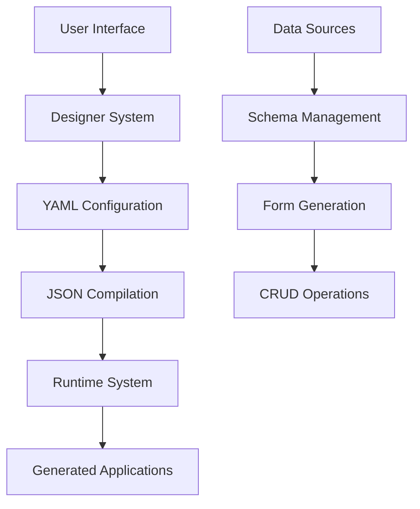

<!-- _class: cover -->

# Aksara IS
## No-Code Platform for Indonesian Businesses

**Strategic Planning & Feasibility Analysis**
*Phase 1 Priority Project - Ak'sara Initiative*

---

<div style="margin-top: 3rem; padding: 2rem; background: rgba(255,255,255,0.15); border-radius: 20px; border: 2px solid rgba(255,255,255,0.2);">

<div style="font-size: 1.2rem; margin-bottom: 1rem;">
**Empowering 64.2 Million Indonesian SMEs**
</div>

<div style="font-size: 1rem; font-style: italic; opacity: 0.9;">
Through Locally-Developed No-Code Solutions
</div>

<div style="margin-top: 2rem; font-size: 0.9rem; opacity: 0.8;">
*A comprehensive strategic analysis for transforming Indonesian business digitalization*
</div>

</div>

---  

## No-Code Platform for Indonesian Businesses

**Planning & Feasibility Analysis**
*Phase 1 Priority Project - Ak'sara Initiative*

---
<!-- footer: © 2025 Ak'sara Initiative | Aksara IS Planning & Feasibility Phase 1   -->

## Executive Summary

<div class="highlight success">

**Vision:** Empower Indonesian businesses to create custom applications without coding expertise

**Current Status:** Advanced SvelteKit-based platform with drag-and-drop form builder

**Market Position:** First Indonesian-focused no-code platform with local language support

</div>

<div class="stats">
  <div class="stat-item">
    <span class="stat-number">12-18</span>
    Months to MVP
  </div>
  <div class="stat-item">
    <span class="stat-number">$225K</span>
    Development Budget
  </div>
  <div class="stat-item">
    <span class="stat-number">100K+</span>
    Target Users
  </div>
</div>

---

## Current Technical Foundation

### **Existing Architecture** ✅
- **SvelteKit with Runes** on Bun runtime
- **Sophisticated designer system** with modular architecture
- **Multi-layered loading strategy:** Core → Defaults → Generated → Runtime
- **YAML-to-JSON compilation** for performance optimization

### **Advanced Features Already Implemented**
- **Drag-and-drop form builder** with real-time preview
- **Component registry system** with extensible architecture
- **Data source integration** (REST API, Database, File Storage)
- **Module and menu management** system
- **Admin vs End-user layout** separation

### **Current Architecture**
<div class="architecture">

```
src/lib/
├── core/          # Always loaded foundation
├── defaults/      # System templates (readonly)
├── workspace/     # User configurations (editable)
├── generated/     # Auto-generated content
└── runtime/       # Compiled outputs (.json from .yaml)
```

</div>

---

## Market Analysis

### **Global No-Code Market**
- **Market Size:** $13.2B (2023) → $65B (2030)
- **Growth Rate:** 25.2% CAGR
- **Key Players:** Bubble, Webflow, Airtable, OutSystems, Mendix

### **Indonesian Business Software Market**
- **Total SMEs:** 64.2M businesses (2023)
- **Digital adoption:** <15% use custom business software
- **Pain Points:** Expensive international solutions, language barriers
- **Opportunity:** 54M+ businesses with manual/spreadsheet-based processes

### **Competitive Landscape Analysis**

**International Players in Indonesia:**
- **Bubble.io:** English-only, $29-349/month
- **Webflow:** Design-focused, not business applications
- **Microsoft Power Platform:** Complex, enterprise-focused
- **Google AppSheet:** Limited customization, Google ecosystem lock-in

**Local Competitors:**
- **Limited Indonesian no-code solutions**
- **Most solutions are custom development services**
- **No major player with Indonesian language priority**

---

## Unique Value Proposition

### **Indonesian-First Approach**
- **Native Bahasa Indonesia** interface and documentation
- **Indonesian business templates** (invoice, inventory, HR)
- **Local compliance** (tax forms, government reports)
- **Cultural context** in workflows and processes

### **Technical Advantages**
- **Modern architecture** (SvelteKit + Bun = faster than competitors)
- **Offline-capable** applications
- **Lightweight deployment** (no vendor lock-in)
- **Open architecture** (export to standard formats)

### **Business Model Innovation**
- **Affordable pricing** (10x cheaper than international solutions)
- **Local payment methods** (bank transfer, e-wallet)
- **Community-driven** template marketplace
- **Professional services** in Indonesian language

---

## Technical Roadmap

### **Phase 1: Core Platform Completion (Months 1-6)**
**Current Status:** 70% complete

**Remaining Work:**
- **Unified page creator** (integrate module + form designer)
- **Core library consolidation** (file operations, schema management)
- **Database integration** completion
- **User authentication** and workspace management

**Key Features to Complete:**
- One-click "Create CRUD Page" workflow
- Advanced component library
- Data validation and business rules
- Export functionality (JSON, API specs)

### **Phase 2: Business Features (Months 7-12)**
**Objective:** Production-ready business application builder

**New Features:**
- **Indonesian business templates** (invoicing, inventory, CRM)
- **Reporting and analytics** builder
- **Workflow automation** (approvals, notifications)
- **Multi-user collaboration** and permissions

**Integration Features:**
- **Payment gateway** integration (Indonesian banks)
- **Government API** integration (e-faktur, NIB)
- **Popular Indonesian services** (WhatsApp Business, Tokopedia)

---

### **Phase 3: Enterprise Features (Months 13-18)**
**Objective:** Enterprise-grade platform with advanced capabilities

**Enterprise Features:**
- **Advanced security** (SSO, LDAP, audit logs)
- **Custom branding** and white-labeling
- **API management** and webhooks
- **Performance monitoring** and scaling

**Platform Features:**
- **Mobile app builder** (Progressive Web Apps)
- **Advanced integrations** (ERP systems, external APIs)
- **Custom component** development framework
- **Multi-tenant** architecture for SaaS deployment

---

## Technical Architecture Deep-Dive

### **Current Architecture Strengths**


### **Performance Optimizations**
- **YAML → JSON compilation** for fast runtime loading
- **Component lazy loading** for large applications
- **Incremental compilation** for designer changes
- **Bun runtime** for superior JavaScript performance

### **Scalability Features**
- **Modular architecture** allows independent scaling
- **Stateless design** for horizontal scaling
- **CDN-ready** asset compilation
- **Database-agnostic** data layer

---

## Business Model

### **Revenue Streams**

**1. SaaS Subscriptions (Primary - 70% revenue)**
- **Starter:** Free (1 app, 2 users, basic features)
- **Professional:** $29/month (5 apps, 10 users, advanced features)
- **Business:** $99/month (20 apps, 50 users, integrations)
- **Enterprise:** $299/month (unlimited, custom features)

**2. Professional Services (25% revenue)**
- **Custom template development:** $2K-10K per template
- **System integration:** $5K-25K per project
- **Training and consulting:** $150-300/hour
- **Migration services:** $3K-15K per organization

**3. Marketplace Revenue (5% revenue)**
- **Template marketplace:** 30% commission on sales
- **Component store:** 20% commission on premium components
- **Integration partnerships:** Revenue sharing with service providers

### **Cost Structure**

**Development (60% of costs):**
- **Core team** (5 developers): $300K/year
- **Platform infrastructure:** $50K/year
- **Third-party services:** $25K/year

**Business Operations (40% of costs):**
- **Sales and marketing:** $100K/year
- **Customer support:** $50K/year
- **Legal and compliance:** $15K/year

---

## Market Entry Strategy

### **Phase 1: Developer & Early Adopter Community (Months 1-6)**
**Target:** Indonesian developers, small agencies, tech-savvy SME owners

**Approach:**
- **Open beta** with developer community
- **Tech conference** demonstrations
- **GitHub** and developer forum engagement
- **Influencer partnerships** with Indonesian tech leaders

**Goals:**
- 1,000 beta users
- 100 published applications
- Community feedback integration
- Technical validation completion

### **Phase 2: SME Market Penetration (Months 7-12)**
**Target:** Small-medium businesses, consultants, local agencies

**Approach:**
- **Business template** library launch
- **Indonesian business** use case marketing
- **Partnership** with business consultants
- **Local success stories** and case studies

**Goals:**
- 5,000 active users
- 500 paying customers
- Template marketplace launch
- Break-even achievement

### **Phase 3: Enterprise Sales (Months 13-18)**
**Target:** Large Indonesian corporations, government agencies

**Approach:**
- **Enterprise feature** rollout
- **Professional sales** team establishment
- **Government procurement** participation
- **System integrator** partnerships

**Goals:**
- 50 enterprise customers
- Government pilot programs
- $1M annual revenue
- Market leadership position

---

## Competitive Advantages

### **Technology Advantages**
1. **Modern architecture** (SvelteKit + Bun) = superior performance
2. **Sophisticated designer** with advanced component system
3. **YAML-based configuration** = human-readable and version-controllable
4. **Offline capability** = works without constant internet connection

### **Market Advantages**
1. **Indonesian language first** - complete localization
2. **Local business context** - templates and workflows
3. **Affordable pricing** - 80% cheaper than international alternatives
4. **Community-driven** - Indonesian developer ecosystem

### **Business Advantages**
1. **First-mover advantage** in Indonesian no-code market
2. **Strong technical foundation** already established
3. **Clear monetization** strategy with multiple revenue streams
4. **Scalable architecture** for rapid growth

---

## Risk Analysis

### **Technical Risks** 🟡

<div class="warning">

**Risk:** Complexity of visual designer for non-technical users
**Mitigation:** Extensive UX testing, tutorial system, template-first approach

**Risk:** Performance issues with complex applications
**Mitigation:** Performance monitoring, optimization guidelines, architecture reviews

</div>

### **Market Risks** 🟢

<div class="success">

**Risk:** Competition from established international players
**Mitigation:** Indonesian-specific features, local partnerships, pricing advantage

**Risk:** Slow adoption by traditional Indonesian businesses
**Mitigation:** Change management support, extensive training, success showcases

</div>

### **Business Risks** 🟡

<div class="warning">

**Risk:** Funding requirements for market expansion
**Mitigation:** Early revenue generation, phased funding, strategic partnerships

**Risk:** Talent acquisition in competitive market
**Mitigation:** Remote-first team, competitive compensation, equity participation

</div>

---

## Success Metrics & KPIs

### **Technical KPIs**
- **Platform uptime:** >99.9%
- **Application generation time:** <30 seconds
- **Designer responsiveness:** <2 seconds for most operations
- **Export compatibility:** 100% with standard formats

### **User Adoption KPIs**
- **Monthly active users:** 1K (Month 6) → 10K (Month 12) → 50K (Month 18)
- **Application creation rate:** 100/month → 1,000/month → 5,000/month
- **User retention:** >70% monthly, >40% annual
- **Template usage:** >80% of users start with templates

### **Business KPIs**
- **Revenue:** $10K (Month 6) → $100K (Month 12) → $1M (Month 18)
- **Customer acquisition cost:** <$50 per user
- **Lifetime value:** >$500 per user
- **Conversion rate:** >5% free to paid

---

## Resource Requirements

### **Development Team (5 people)**
- **Technical Lead** - $85K/year (architecture, core development)
- **Frontend Developer** - $70K/year (SvelteKit, designer UI)
- **Backend Developer** - $70K/year (APIs, data layer)
- **UX/UI Designer** - $60K/year (user experience, templates)
- **QA Engineer** - $50K/year (testing, quality assurance)

### **Business Team (3 people)**
- **Product Manager** - $80K/year (roadmap, user research)
- **Marketing Manager** - $60K/year (growth, content)
- **Customer Success** - $45K/year (support, onboarding)

### **Infrastructure & Operations**
- **Cloud infrastructure** (AWS/GCP): $25K/year
- **Development tools** and services: $15K/year
- **Marketing** and user acquisition: $50K/year
- **Legal** and business setup: $10K/year

---

## Financial Projections

### **5-Year Revenue Model**

**Year 1:** $100K
- 1,000 users, 10% conversion rate
- Average $100/user annual revenue

**Year 2:** $1M
- 10,000 users, 15% conversion rate
- Average $120/user annual revenue

**Year 3:** $5M
- 50,000 users, 20% conversion rate
- Average $150/user annual revenue + enterprise

**Year 4:** $15M
- 150,000 users, 25% conversion rate
- Average $200/user + professional services

**Year 5:** $35M
- 350,000 users, 30% conversion rate
- Average $250/user + marketplace + enterprise

### **Investment Requirements**

**Seed Round:** $500K (12 months)
- Complete MVP development
- Initial team building
- Market validation

**Series A:** $2M (24 months)
- Market expansion
- Enterprise features
- Team scaling

**Break-even:** Month 15
**Profitability:** Month 18
**ROI:** 25x over 5 years

---

## Strategic Partnerships

### **Technology Partners**
1. **Cloud providers** (AWS, Google Cloud) - credits and support
2. **Payment gateways** (Midtrans, Xendit) - integration partnerships
3. **Indonesian APIs** (e-faktur, government services) - official partnerships

### **Business Partners**
1. **Business consultants** - template development and user acquisition
2. **System integrators** - enterprise sales and implementation
3. **Educational institutions** - training programs and certification

### **Distribution Partners**
1. **Indonesian ISVs** - white-label partnerships
2. **Hosting providers** - bundle offerings
3. **Business associations** - member benefits and training

---

## Implementation Timeline

### **Development Phases**

**Q1 2024: Foundation**
- Complete core platform features
- Launch beta testing program
- Build initial template library
- Establish development processes

**Q2 2024: Market Entry**
- Public launch with freemium model
- Indonesian business template release
- Marketing campaign initiation
- Community building programs

**Q3 2024: Growth**
- Enterprise features development
- Partnership establishment
- Professional services launch
- International expansion planning

**Q4 2024: Scale**
- Advanced features rollout
- Government pilot programs
- Series A funding
- Team expansion

### **Key Milestones**
- **M1:** MVP completion (Month 3)
- **M2:** Beta launch (Month 6)
- **M3:** Commercial launch (Month 9)
- **M4:** Break-even achievement (Month 15)
- **M5:** Market leadership (Month 24)

---

## Conclusion

### **Strategic Advantages Summary**
- **Strong technical foundation** with 70% complete advanced platform
- **Clear market opportunity** in underserved Indonesian SME segment
- **Differentiated value proposition** through localization and pricing
- **Scalable business model** with multiple revenue streams

### **Success Factors**
- **Rapid completion** of remaining technical development
- **Effective market entry** with Indonesian-specific features
- **Strong partnerships** for distribution and growth
- **Quality execution** of user experience and support

### **Investment Attractiveness**
- **Large addressable market** (64M+ Indonesian SMEs)
- **Proven technology foundation** reduces execution risk
- **Clear path to profitability** within 18 months
- **Multiple exit opportunities** through strategic acquisition

<div class="highlight">
<strong>Aksara IS represents the highest-probability success within the Ak'sara Initiative, combining proven technology with clear market demand.</strong>
</div>

---

## Next Steps

### **Immediate Priorities (30 days)**
1. **Complete unified page creator** integration
2. **Finalize core team** recruitment
3. **Launch beta testing** with 100 selected users
4. **Establish key partnerships** discussions

### **Short-term Goals (90 days)**
1. **Public beta launch** with marketing campaign
2. **Template marketplace** MVP release
3. **Strategic partnerships** establishment
4. **Seed funding** completion

### **Medium-term Objectives (180 days)**
1. **Commercial launch** with paid plans
2. **1,000 active users** milestone
3. **Enterprise features** development
4. **Break-even** achievement

---

**Contact Information:**
- **Product Lead:** [To be assigned]
- **Technical Lead:** [To be assigned]
- **Business Development:** [To be assigned]
- **Email:** aksara@aksara-initiative.org