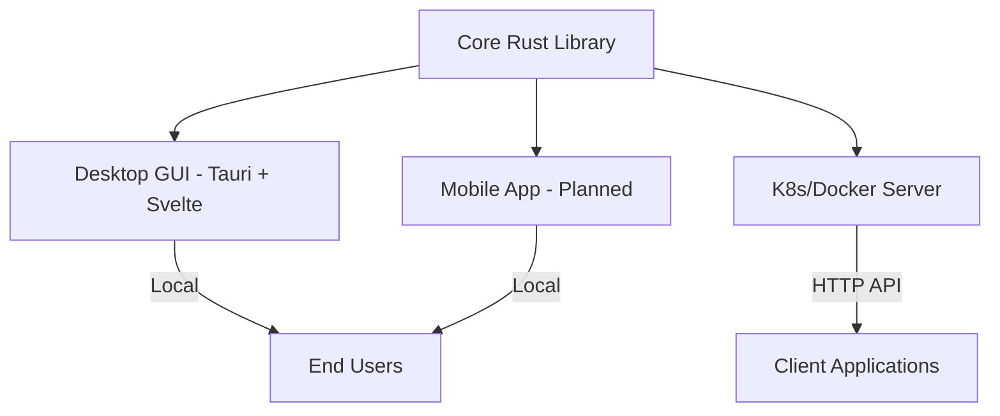

# Personal AI Assistant
## Offline Intelligence for Indonesia

**Planning & Feasibility Analysis**
*Phase 2 of Ak'sara Initiative*

---

## Executive Summary

**Vision:** Privacy-first, offline AI assistant with native Bahasa Indonesia support

**Current Status:** Multi-platform architecture with Rust core + Tauri desktop

**Unique Value:** Complete offline operation, cultural context, data sovereignty

  

    18-24
    Months Timeline
  

  

    $750K
    Development Budget
  

  

    100K+
    Target Users
  

---

## Current Technical Foundation

### **Existing Architecture** ✅
- **Core Rust library** with HTTP server and AI service
- **Multi-target deployment:** Desktop (Tauri), Server (Docker/K8s), Mobile (planned)
- **Flexible infrastructure:** Port auto-discovery, Docker containerization
- **API-ready:** RESTful endpoints (/health, /status, /chat, /models)

### **Technology Stack Analysis**

### **Current Capabilities**
- **Multi-platform server** (Docker + native compilation)
- **Desktop application** (Bun + Svelte + Tauri)
- **Automatic port management** (8080+ with auto-discovery)
- **Containerized deployment** ready for production

---

## Market Opportunity Analysis

### **Global AI Assistant Market**
- **Market Size:** $3.8B (2023) → $15.7B (2030)
- **Growth Rate:** 23.5% CAGR
- **Key Players:** Siri, Google Assistant, Alexa, ChatGPT

### **Indonesian Market Specifics**
- **Population:** 270M+ potential users
- **Smartphone penetration:** 89% (240M+ devices)
- **Privacy concerns:** High awareness of data sovereignty
- **Language barrier:** Limited Bahasa Indonesia support in global solutions

### **Unique Market Position**

**Privacy-First Approach:** Complete offline operation eliminates data privacy concerns

**Cultural Relevance:** Native Bahasa Indonesia with Indonesian cultural context

**Economic Independence:** Reduces dependency on foreign cloud services

---

## Competitive Analysis

### **International Competitors**

**1. ChatGPT (OpenAI)**
- ❌ **Requires internet connection**
- ❌ **Data sent to foreign servers**
- ❌ **Limited Bahasa Indonesia support**
- ❌ **Subscription-based model**

**2. Google Assistant**
- ❌ **Heavy Google ecosystem dependency**
- ❌ **Privacy concerns with data collection**
- ❌ **Limited offline capabilities**
- ❌ **Not optimized for Indonesian context**

**3. Siri (Apple)**
- ❌ **iOS/macOS ecosystem lock-in**
- ❌ **Poor Bahasa Indonesia support**
- ❌ **Limited customization options**
- ❌ **Requires internet for advanced features**

### **Local/Regional Competitors**
- **Limited Indonesian AI solutions**
- **No major offline AI assistants**
- **Opportunity for first-mover advantage**

---

## Technical Roadmap

### **Phase 1: Core AI Engine (Months 1-6)**
**Objective:** Offline LLM integration with Bahasa Indonesia support

**Key Deliverables:**
- Local LLM integration (Llama 2, Code Llama, or Indonesian fine-tuned models)
- Bahasa Indonesia language processing pipeline
- Offline knowledge base with Indonesian context
- Basic chat interface and API

**Technical Specifications:**
- **Model Size:** 7B-13B parameters (optimal for local hardware)
- **Memory Requirements:** 8-16GB RAM for optimal performance
- **Storage Requirements:** 10-20GB for models and knowledge base
- **Performance Target:** <2 second response time for simple queries

### **Phase 2: Platform Integration (Months 7-12)**
**Objective:** Multi-platform deployment and ecosystem integration

**Key Deliverables:**
- Enhanced Tauri desktop application
- Mobile app development (Android priority)
- Integration with Aksara IS (no-code platform)
- Cloud sync for user preferences (encrypted)

**Features:**
- **Voice recognition** with Bahasa Indonesia
- **Document analysis** and summarization
- **Code assistance** for Indonesian developers
- **Business context** understanding (Indonesian business practices)

---

### **Phase 3: Advanced Features (Months 13-18)**
**Objective:** Advanced AI capabilities and business integration

**Key Deliverables:**
- **Multi-modal capabilities** (text, voice, documents)
- **Business workflow integration**
- **Custom model fine-tuning** for specific industries
- **Enterprise deployment tools**

**Advanced Features:**
- **Document OCR** with Indonesian text recognition
- **Email/message drafting** in professional Bahasa Indonesia
- **Meeting transcription** and summarization
- **Business intelligence** and data analysis

### **Phase 4: Commercialization (Months 19-24)**
**Objective:** Market deployment and revenue generation

**Key Deliverables:**
- **Enterprise licensing** and deployment tools
- **Professional services** and customization
- **Training programs** and certification
- **Hardware partnerships** for optimized devices

---

## Business Model

### **Revenue Streams**

**1. Software Licensing (Primary)**
- **Individual licenses:** $29-99/year per user
- **Business licenses:** $199-499/year per user
- **Enterprise licenses:** $999-2999/year per user
- **OEM licensing:** $5-15 per device pre-installation

**2. Professional Services**
- **Custom model training:** $50K-200K per project
- **Enterprise deployment:** $25K-100K per organization
- **Integration services:** $150-300/hour
- **Training and consulting:** $2K-10K per engagement

**3. Hardware Partnerships**
- **Optimized hardware bundles** with laptop manufacturers
- **AI-ready device certification** programs
- **Revenue sharing** with hardware partners

### **Cost Structure**

**Development Costs:**
- **AI/ML Engineers** (3): $250K/year
- **Mobile/Desktop Developers** (2): $120K/year
- **DevOps/Infrastructure** (1): $80K/year
- **Research & model training:** $100K/year

**Operational Costs:**
- **Model training infrastructure:** $50K/year
- **Distribution and updates:** $30K/year
- **Customer support:** $40K/year

---

## Technical Challenges & Solutions

### **Critical Challenges** 🔴

**Challenge:** Limited availability of high-quality Indonesian language models
**Solution:** Partner with Indonesian universities for model training, contribute to open-source Indonesian NLP

**Challenge:** Hardware requirements for local LLM inference
**Solution:** Model optimization, quantization, hardware-specific optimizations

### **Significant Challenges** 🟡

**Challenge:** Battery consumption on mobile devices
**Solution:** Efficient model architectures, on-demand loading, power management

**Challenge:** Keeping models updated without internet dependency
**Solution:** Incremental updates, local knowledge base updates, community contributions

### **Manageable Challenges** 🟢

**Challenge:** User interface in multiple Indonesian languages
**Solution:** Leverage existing translation frameworks, community localization

**Challenge:** Integration with existing Indonesian business tools
**Solution:** Standard APIs, plugin architecture, partnership integrations

---

## Market Entry Strategy

### **Phase 1: Developer & Tech Community (Months 1-6)**
**Target:** Indonesian developers, tech startups, early adopters

**Approach:**
- **Open source** core components
- **Developer beta** program
- **Tech conference** presentations
- **GitHub** community building

### **Phase 2: Business Professionals (Months 7-12)**
**Target:** SME owners, consultants, remote workers

**Approach:**
- **Productivity use cases** (email, documents, scheduling)
- **Professional trial** programs
- **Business community** engagement
- **ROI case studies**

### **Phase 3: Enterprise Market (Months 13-18)**
**Target:** Large Indonesian corporations, government agencies

**Approach:**
- **Enterprise features** (security, management, compliance)
- **Pilot programs** with major organizations
- **Professional sales** team
- **Partnership** with system integrators

### **Phase 4: Consumer Market (Months 19-24)**
**Target:** General Indonesian consumers

**Approach:**
- **Hardware bundling** with laptops/smartphones
- **Educational partnerships** (schools, universities)
- **Consumer marketing** campaigns
- **Freemium model** for mass adoption

---

## Risk Analysis

### **Technical Risks**

**1. Model Performance & Quality**
- **Risk:** Indonesian language models may have lower quality than English
- **Mitigation:** Invest in training data collection, partner with linguistic experts
- **Impact:** High | **Probability:** Medium

**2. Hardware Compatibility**
- **Risk:** Performance issues on lower-end Indonesian devices
- **Mitigation:** Multiple model sizes, optimization for budget hardware
- **Impact:** Medium | **Probability:** Medium

### **Market Risks**

**3. Competition from Big Tech**
- **Risk:** Google/Microsoft launching Indonesian offline AI
- **Mitigation:** First-mover advantage, deep local integration, community building
- **Impact:** High | **Probability:** Low-Medium

**4. Regulatory Changes**
- **Risk:** Government restrictions on AI technology
- **Mitigation:** Compliance-first design, government partnerships, transparency
- **Impact:** Medium | **Probability:** Low

### **Business Risks**

**5. Funding Requirements**
- **Risk:** High upfront costs for AI model development
- **Mitigation:** Phased funding, early revenue generation, strategic partnerships
- **Impact:** High | **Probability:** Medium

---

## Success Metrics & KPIs

### **Technical KPIs**
- **Response time:** <2 seconds for 90% of queries
- **Accuracy:** >85% for Bahasa Indonesia understanding
- **Uptime:** >99.9% for offline operation
- **Model size:** <10GB for basic model, <20GB for advanced

### **Adoption KPIs**
- **Year 1:** 1,000 active users (beta/early access)
- **Year 2:** 10,000 active users (paid customers)
- **Year 3:** 100,000+ active users (market presence)
- **Enterprise clients:** 50+ organizations by Year 2

### **Business KPIs**
- **Revenue:** $100K (Year 1), $1M (Year 2), $5M (Year 3)
- **Customer satisfaction:** >4.5/5 rating
- **Retention rate:** >80% annual retention
- **Market share:** 5% of Indonesian AI assistant market by Year 3

---

## Resource Requirements

### **Team Structure**

**Core Development Team (6 people):**
- **AI/ML Lead** - $100K/year (model development, training)
- **Rust Core Developer** - $85K/year (backend systems)
- **Frontend Developer** - $70K/year (Svelte/Tauri UI)
- **Mobile Developer** - $70K/year (Android/iOS apps)
- **NLP Specialist** - $80K/year (Indonesian language processing)
- **DevOps Engineer** - $75K/year (deployment, infrastructure)

**Supporting Team (3 people):**
- **Product Manager** - $80K/year
- **UX/UI Designer** - $60K/year
- **QA Engineer** - $50K/year

### **Infrastructure Requirements**

**Development:**
- **GPU training cluster:** $100K initial + $30K/year
- **Model storage and distribution:** $20K/year
- **Development tools and licenses:** $15K/year

**Production:**
- **User analytics and telemetry:** $10K/year
- **Update distribution system:** $25K/year
- **Customer support tools:** $15K/year

---

## Financial Projections

### **5-Year Revenue Forecast**

**Year 1:** $100K (1K users, average $100/user)
- Beta users, early adopters, pilot programs

**Year 2:** $1M (10K users, average $100/user)
- Professional users, small business adoption

**Year 3:** $5M (50K users, average $100/user)
- Enterprise clients, hardware partnerships

**Year 4:** $12M (100K users, average $120/user)
- Mass market adoption, premium features

**Year 5:** $25M (200K users, average $125/user)
- Market leadership, international expansion

### **Investment Requirements**

**Seed Round:** $750K (18 months)
- Core team building
- Initial model development
- Platform creation

**Series A:** $3M (24 months)
- Market expansion
- Enterprise features
- Hardware partnerships

**Break-even:** Month 24
**ROI:** 20x over 5 years

---

## Strategic Partnerships

### **Technology Partners**

**1. Indonesian Universities**
- **Partnership:** Research collaboration for Indonesian NLP
- **Value:** Access to linguistic expertise and datasets
- **Examples:** UI, ITB, UGM Computer Science departments

**2. Hardware Manufacturers**
- **Partnership:** Optimized deployment on Indonesian devices
- **Value:** Performance optimization, pre-installation opportunities
- **Examples:** Advan, Polytron, Axioo

### **Business Partners**

**3. System Integrators**
- **Partnership:** Enterprise deployment and customization
- **Value:** Sales channel, implementation expertise
- **Examples:** Local IT consulting firms, software houses

**4. Government Agencies**
- **Partnership:** Pilot programs and validation
- **Value:** Credibility, large-scale testing, procurement opportunities
- **Examples:** Ministry of Communication, BUMN companies

---

## Intellectual Property Strategy

### **Core IP Assets**
- **Indonesian language models** and training datasets
- **Offline AI optimization** techniques
- **Cultural context** algorithms and knowledge bases
- **Multi-platform** deployment architecture

### **IP Protection Strategy**
- **Trade secrets** for proprietary algorithms
- **Patents** for novel optimization techniques
- **Open source** for community components
- **Trademarks** for brand and product names

### **Open Source Strategy**
- **Core libraries** open source for community adoption
- **Model training frameworks** open source for research
- **Proprietary models** and business features closed source
- **Community contributions** encouraged and integrated

---

## Implementation Timeline

### **Critical Path**

**Months 1-3: Foundation**
- Team recruitment and setup
- Technology stack finalization
- Initial model evaluation and selection
- Partnership discussions initiation

**Months 4-6: Core Development**
- Indonesian language model integration
- Basic desktop application development
- API framework completion
- Alpha testing with internal team

**Months 7-9: Platform Expansion**
- Mobile application development
- Enterprise features implementation
- Beta testing program launch
- Strategic partnerships establishment

**Months 10-12: Market Preparation**
- Production deployment infrastructure
- Sales and marketing team building
- Pilot customer acquisition
- Go-to-market strategy execution

### **Key Milestones**
- **M1:** First working prototype (Month 3)
- **M2:** Alpha release with basic features (Month 6)
- **M3:** Beta release with mobile app (Month 9)
- **M4:** Commercial launch (Month 12)
- **M5:** First enterprise customer (Month 15)
- **M6:** Profitability achievement (Month 24)

---

## Conclusion

### **Strategic Advantages**
- **First-mover advantage** in Indonesian offline AI market
- **Strong technical foundation** with working multi-platform architecture
- **Clear value proposition** addressing privacy and sovereignty concerns
- **Multiple monetization** opportunities across consumer and enterprise

### **Success Factors**
- **Quality Indonesian language** support and cultural relevance
- **Performance optimization** for local hardware constraints
- **Strategic partnerships** with hardware manufacturers and businesses
- **Community building** for long-term ecosystem growth

### **Investment Attractiveness**
- **Large addressable market** with 270M+ potential users
- **Differentiated product** with unique offline capabilities
- **Multiple revenue streams** reducing business risk
- **Clear path to profitability** within 24 months

<strong>Personal AI Assistant represents a unique opportunity to create Indonesian digital sovereignty while building a profitable, scalable business.</strong>

---

## Next Steps

### **Immediate Actions (30 days)**
1. **Finalize technical architecture** and model selection
2. **Recruit core AI/ML team** members
3. **Setup development infrastructure** and tooling
4. **Begin Indonesian dataset** collection and preparation

### **Strategic Initiatives (90 days)**
1. **Launch beta testing program** with selected users
2. **Establish university partnerships** for research collaboration
3. **Initiate hardware manufacturer** discussions
4. **Secure seed funding** from strategic investors

### **Market Entry (180 days)**
1. **Complete alpha version** with core features
2. **Begin enterprise pilot** programs
3. **Build developer community** around platform
4. **Prepare commercial launch** strategy

---

**Contact Information:**
- **AI Research Lead:** [To be assigned]
- **Product Manager:** [To be assigned]
- **Business Development:** [To be assigned]
- **Email:** ai@aksara-initiative.org