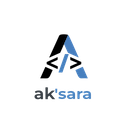

<!--
aksara:true
type: presentation
size: 16:9
style: ./style.css
meta:
    title: "Personal AI Assistant: Offline-First Indonesian AI"
    subtitle: "Proposal for developing local personal AI assistant"
    author: "Ak'sara Initiative"
    keywords: "AI, Personal Assistant, Offline, Indonesian, Tauri, Privacy"
header: Personal AI Assistant Proposal | 
footer: © 2025 Ak'sara Initiative
background: ../assets/background.jpeg
-->
<!-- class:cover -->
# Personal AI Assistant
## Offline-First Indonesian AI for Privacy & Performance

**Project Proposal & Technical Architecture**
*Ak'sara Initiative - Phase 4 Project*

---

# Executive Summary

**Personal AI Assistant** adalah aplikasi AI pribadi yang berjalan sepenuhnya offline, dirancang khusus untuk user Indonesia dengan fokus pada privacy, performance, dan pemahaman konteks budaya lokal.

<div class="highlight">

**Vision:** Memberikan akses AI yang powerful, private, dan personalized untuk setiap user Indonesia tanpa ketergantungan pada cloud services atau risiko privacy breach.

</div>

<div class="stats">
  <div class="stat-item">
    <span class="stat-number">18-24</span>
    Bulan Pengembangan
  </div>
  <div class="stat-item">
    <span class="stat-number">$500K</span>
    Estimasi Budget
  </div>
  <div class="stat-item">
    <span class="stat-number">5M+</span>
    Target Users
  </div>
</div>

---
<!-- class:smallText -->
## Strategic Context & Market Need
<div><div>

### **Privacy Crisis in AI**
- **Data sovereignty**: Indonesian user data processed di foreign servers
- **Privacy concerns**: Personal conversations, documents exposed ke third parties
- **Dependency risks**: Service disruptions, policy changes beyond control
- **Cultural misunderstanding**: AI models tidak memahami konteks Indonesia

### **Indonesian AI Gap**
- **Language barriers**: Existing AI lemah dalam Bahasa Indonesia
- **Cultural context**: Tidak paham adat, budaya, business practices Indonesia
- **Local knowledge**: Limited understanding tentang geography, history, regulasi
- **Economic impact**: Indonesian payments untuk foreign AI services
</div><div>

### **Technical Opportunity**
- **Local processing power**: Modern laptops capable untuk run AI models
- **Model improvements**: Smaller, efficient models dengan quality comparable
- **Open source momentum**: Community-driven AI development growing
- **Edge computing**: Trend toward local processing untuk privacy

### **Market Demand**
- **Privacy-conscious users**: Growing awareness tentang data privacy
- **Professional users**: Lawyers, doctors, consultants yang need confidentiality
- **Students & researchers**: Academic work dengan sensitive data
- **Small businesses**: Cost-effective AI tanpa subscription fees
</div></div>

---

## Technical Architecture

### **Core Technology Stack**
<div><div>

**Application Framework: Tauri**
- **Cross-platform**: Windows, macOS, Linux support
- **Performance**: Rust backend dengan web frontend
- **Security**: Sandboxed execution environment
- **Small footprint**: Lightweight installer dan memory usage
</div><div>

**AI Engine: Local LLM**
- **Model selection**: 7B-13B parameter models optimized untuk consumer hardware
- **Quantization**: 4-bit/8-bit untuk memory efficiency
- **Inference**: llama.cpp atau candle untuk fast execution
- **Hardware acceleration**: CPU optimization, optional GPU support
</div><div>

**Indonesian Language Support:**
- **Fine-tuned models**: Indonesian language dan cultural training
- **Local knowledge base**: Indonesian geography, history, regulations
- **Business context**: Understanding Indonesian business practices
- **Cultural awareness**: Adat, traditions, social norms
</div></div>

---

## Technical Architecture
### **System Architecture**

```
Personal AI Assistant Components:
├── Frontend (React/TypeScript)
│   ├── Chat Interface
│   ├── Document Analysis
│   ├── Task Management
│   └── Settings & Privacy
├── Backend (Rust)
│   ├── AI Model Inference
│   ├── Document Processing
│   ├── Local Storage
│   └── System Integration
├── AI Models
│   ├── Base LLM (Indonesian-tuned)
│   ├── Code Assistant
│   ├── Document Summarizer
│   └── Task Planner
└── Data Storage
    ├── Encrypted User Data
    ├── Conversation History
    ├── Document Index
    └── Personal Knowledge Base
```

---
<!-- class:smallText -->
## Key Features & Capabilities

### **Core AI Functions**
<div><div>

**Conversational AI:**
- **Natural Bahasa Indonesia**: Fluent conversation dalam berbagai register
- **Cultural context**: Understanding Indonesian social norms dan business etiquette
- **Personal memory**: Remembers user preferences, history, context
- **Multi-modal**: Text, voice input dengan local speech recognition

**Document Intelligence:**
- **PDF analysis**: Read, summarize, answer questions about documents
- **Indonesian documents**: Understand government forms, business letters, contracts
- **Multi-language**: Process English documents dengan Indonesian explanations
- **Privacy-first**: Documents never leave user's device
</div><div>

**Business Assistant:**
- **Email drafting**: Professional Indonesian business correspondence
- **Meeting prep**: Agenda creation, talking points, follow-ups
- **Document generation**: Using Aksara Writer integration untuk reports, proposals
- **Task management**: Smart reminders, priority suggestions
</div></div>

---
<!-- class:smallText -->
## Key Features & Capabilities

### **Indonesian-Specific Features**
<div><div>

**Government & Legal Support:**
- **Form assistance**: Help dengan tax forms, permit applications
- **Regulation lookup**: Understanding Indonesian laws dan regulations
- **Business compliance**: Guidance untuk legal requirements
- **Local procedures**: Step-by-step guides untuk bureaucratic processes

**Cultural Intelligence:**
- **Regional awareness**: Understanding different Indonesian cultures
- **Business customs**: Appropriate greetings, meeting etiquette, gift-giving
- **Religious considerations**: Respectful responses untuk religious topics
- **Language registers**: Formal, informal, professional language use
</div><div>

**Local Knowledge:**
- **Geography**: Detailed knowledge tentang Indonesian cities, provinces
- **Transportation**: Public transport, travel routes, schedules
- **Food culture**: Recipes, dietary restrictions, regional specialties
- **Current events**: Understanding Indonesian news dan political context
</div></div>

---

## Privacy & Security Features

### **Offline-First Architecture**

<div><div>

**Complete Local Processing:**
- AI models run entirely pada user's device
- No data transmission ke external servers
- Internet hanya untuk optional model updates
- Full functionality without network connection

</div><div>

**Data Protection:**
- **Encrypted storage**: All user data encrypted at rest
- **Memory protection**: Secure handling dalam RAM
- **No telemetry**: Zero data collection atau tracking
- **User control**: Complete ownership atas personal data

**Trust & Transparency:**
- **Open source**: Full code audit capability
- **Local deployment**: No dependency pada external services
- **Verifiable privacy**: Users can confirm offline operation
- **Community oversight**: Open development process
</div></div>

---

## Development Roadmap

### **Phase 1: Core Foundation (Months 1-6)**
**Focus**: Basic AI assistant dengan Indonesian language support
<div><div>

**Deliverables:**
- Tauri application framework
- Indonesian-tuned LLM integration
- Basic chat interface
- Local document processing
- Alpha release untuk testing

</div><div>

**Team Requirements:**
- 2 Rust developers
- 1 AI/ML engineer
- 1 Frontend developer
- 1 Indonesian linguist
</div></div>

---

## Development Roadmap

### **Phase 2: Advanced Features (Months 7-12)**
**Focus**: Business functions dan cultural intelligence
<div><div>

**Deliverables:**
- Document analysis capabilities
- Business assistant features
- Voice input/output
- Aksara Writer integration
- Beta release dengan user testing
</div><div>

**Team Requirements:**
- 1 additional AI engineer
- 1 speech processing specialist
- 1 cultural consultant
- 1 UX designer
</div></div>

---

## Development Roadmap

### **Phase 3: Platform Integration (Months 13-18)**
**Focus**: Ecosystem integration dan optimization
<div><div>

**Deliverables:**
- MerdekaOS optimization
- Aksara IS integration
- Advanced personalization
- Performance optimization
- Public release candidate
</div><div>

**Team Requirements:**
- 1 systems integration engineer
- 1 performance optimization specialist
- 1 QA engineer
</div></div>
---

## Development Roadmap

### **Phase 4: Market Launch (Months 19-24)**
**Focus**: Production release dan user adoption
<div><div>

**Deliverables:**
- Stable 1.0 release
- Distribution partnerships
- User documentation
- Community support infrastructure
- Marketing campaigns
</div><div>

**Team Requirements:**
- 1 product manager
- 1 community manager
- 1 technical writer
- 1 marketing specialist
</div></div>

---
<!-- class:smallText -->
## Business Model & Distribution

### **Distribution Channels**
<div><div>

**Direct Distribution:**
- Official website download
- Auto-update mechanism
- Community forums dan support
</div><div>

**OEM Partnerships:**
- Pre-installation pada MerdekaOS
- Bundled dengan Indonesian laptops
- Government procurement contracts
</div><div>

**Enterprise Sales:**
- Corporate licenses
- Custom implementations
- Training dan consulting services
</div></div>

### **Freemium Strategy**
<div><div>

**Free Tier:**
- Basic AI assistant functionality
- Standard Indonesian language model
- Local document processing (up to 50 documents)
- Community support
</div><div>

**Pro Tier ($9.99/month):**
- Advanced AI models (larger, more capable)
- Unlimited document processing
- Voice input/output
- Priority feature updates
- Email support
</div><div>

**Enterprise Tier ($99/month):**
- Custom model fine-tuning
- Advanced security features
- Integration APIs
- Dedicated support
- Custom deployment
</div></div>

---

## Market Analysis & Competition

### **Competitive Landscape**

| Solution | Type | Strengths | Weaknesses |
|----------|------|-----------|------------|
| **ChatGPT** | Cloud-based | Powerful, updated | Privacy, cost, dependency |
| **Claude** | Cloud-based | Safety-focused | Limited Indonesian |
| **Local LLMs** | Self-hosted | Privacy | Technical complexity |
| **Personal AI** | **Offline** | **Privacy + Easy** | **New solution** |

---
<!-- class:smallText -->
## Market Analysis & Competition

### **Target Market Segments**
<div><div>

**Primary Users:**
- **Privacy-conscious professionals**: Lawyers, doctors, consultants
- **Government workers**: Civil servants handling sensitive documents
- **Business owners**: SME owners needing business assistance
- **Students**: University students studying atau working
</div><div>

**Secondary Users:**
- **Developers**: Using for code assistance dan documentation
- **Content creators**: Writers, bloggers, social media managers
- **Researchers**: Academic researchers dengan sensitive data
- **Remote workers**: People needing productivity assistance
</div></div>

**Market Size:**
- **Indonesian professionals**: 50M+ potential users
- **Privacy-conscious segment**: 10M early adopters
- **Business users**: 5M SME owners dan employees
- **Government market**: 2M civil servants

---
<!-- class:smallText -->
## Technical Implementation Details

<div><div>

### **AI Model Strategy**

**Base Model Selection:**
- **Llama 2/3 13B**: Strong foundation model
- **Indonesian fine-tuning**: Training dengan Indonesian text corpus
- **Cultural adaptation**: Business, government, cultural context training
- **Quantization**: 4-bit untuk 8GB RAM, 8-bit untuk 16GB+ RAM

**Model Deployment:**
- **GGML format**: Optimized untuk CPU inference
- **Metal/CUDA**: GPU acceleration when available
- **Dynamic loading**: Load/unload models based pada memory
- **Model updates**: Optional downloads untuk improvements
</div><div>

### **Performance Optimization**

**Hardware Requirements:**
- **Minimum**: 8GB RAM, modern CPU (2020+)
- **Recommended**: 16GB RAM, dedicated GPU
- **Storage**: 10GB untuk models dan application
- **Platforms**: Windows 10+, macOS 11+, Linux

**Optimization Techniques:**
- **Model quantization**: Reduce memory footprint
- **Batching**: Efficient processing untuk multiple requests
- **Caching**: Smart caching untuk repeated queries
- **Progressive loading**: Load components as needed
</div></div>

---
<!-- class:smallText -->
## Risk Analysis & Mitigation

### **Technical Risks** 🟡

<div class="warning">

**Risk**: AI model quality insufficient untuk real-world use
**Mitigation**: Extensive testing, iterative improvement, community feedback

**Risk**: Performance issues pada lower-end hardware
**Mitigation**: Multiple model sizes, optimization, hardware testing

**Risk**: Indonesian language training data quality
**Mitigation**: Professional linguist involvement, community validation

</div>

### **Business Risks** 🟡

<div class="warning">

**Risk**: User adoption slower than projected
**Mitigation**: Free tier, education campaigns, partnership distribution

**Risk**: Competition dari big tech companies
**Mitigation**: Privacy focus, local optimization, community building

**Risk**: Monetization challenges dengan offline model
**Mitigation**: Premium features, enterprise services, partnership revenue

</div>

### **Privacy & Security Risks** 🟢

<div class="success">

**Risk**: Security vulnerabilities dalam local storage
**Mitigation**: Security audits, encryption, open source transparency

**Risk**: Model bias atau inappropriate responses
**Mitigation**: Careful training, safety filters, user controls

</div>

---

## Success Metrics & KPIs
<div><div>

### **Technical KPIs**
- **Response time**: <2 seconds untuk typical queries
- **Model accuracy**: >85% untuk Indonesian language tasks
- **Memory usage**: <4GB RAM untuk basic model
- **Battery efficiency**: <10% additional battery drain

### **User Adoption KPIs**
- **Downloads**: 100K (Month 6) → 1M (Month 12) → 5M (Month 24)
- **Active users**: 60% monthly retention
- **Premium conversion**: 5% freemium to paid conversion
- **User satisfaction**: >4.5/5 rating
</div><div>

### **Business KPIs**
- **Revenue**: $100K (Year 1) → $2M (Year 2) → $10M (Year 3)
- **Enterprise customers**: 100 companies by Year 2
- **Government adoption**: 5 agencies by Year 2
- **Market position**: Top 3 Indonesian AI assistants

### **Privacy KPIs**
- **Zero data breaches**: Maintain perfect privacy record
- **Audit compliance**: Pass independent security audits
- **Transparency score**: Full open source audit coverage
- **User trust**: >90% users confident dalam privacy protection
</div></div>

---
<!-- class:smallText -->
## Resource Requirements
<div><div>

### **Development Team**
- **AI/ML Lead**: Model training, Indonesian NLP ($120K/year)
- **Rust Engineers (2)**: Backend development, optimization ($90K/year each)
- **Frontend Developer**: React/TypeScript UI ($75K/year)
- **Speech Engineer**: Voice processing ($85K/year)
- **Indonesian Linguist**: Language training, cultural consultation ($60K/year)

### **Infrastructure & Tools**
- **GPU cluster**: Model training dan validation ($50K/year)
- **Development hardware**: Testing devices ($20K one-time)
- **AI training data**: Indonesian corpus licensing ($30K/year)
- **Cloud services**: Development dan distribution ($25K/year)
</div><div>

### **Specialized Costs**
- **Security audits**: External security reviews ($40K/year)
- **Legal compliance**: Privacy law consultation ($20K/year)
- **Cultural consulting**: Indonesian cultural experts ($25K/year)
- **Performance testing**: Hardware compatibility ($15K/year)
</div></div>
---
<!-- class:smallText -->
## Strategic Impact & Long-term Vision
<div><div>

### **National Technology Goals**
- **AI sovereignty**: Reduced dependency pada foreign AI services
- **Privacy leadership**: Indonesia as leader dalam privacy-first AI
- **Cultural preservation**: AI yang understands dan respects Indonesian culture
- **Economic impact**: Local AI development instead of foreign payments

### **Ak'sara Ecosystem Integration**
- **Aksara IS integration**: AI assistant untuk no-code platform users
- **Aksara Writer enhancement**: AI-powered document creation
- **MerdekaOS optimization**: Perfect integration dengan local OS
- **Developer tools**: AI assistance untuk Indonesian developers
</div><div>

### **Long-term Opportunities**
- **AI platform**: Foundation untuk other Indonesian AI applications
- **Enterprise solutions**: Custom AI assistants untuk companies
- **Educational AI**: Specialized tutoring untuk Indonesian students
- **Government AI**: Specialized assistants untuk public services

### **Research & Development**
- **Indonesian NLP**: Advance state-of-the-art dalam Indonesian language processing
- **Edge AI**: Contribute ke global edge computing research
- **Privacy-preserving AI**: Pioneer techniques untuk private AI
- **Cultural AI**: Research tentang culturally-aware AI systems
</div></div>

---

## Financial Projections

### **5-Year Revenue Model**
<div><div>

**Year 1**: $100K
- 100K users, 1% premium conversion
- $9.99/month average revenue
</div><div>

**Year 2**: $2M
- 1M users, 3% premium conversion
- Enterprise tier adoption
</div><div>

**Year 3**: $10M
- 5M users, 5% premium conversion
- Government contracts
</div><div>

**Year 4**: $25M
- 10M users, 7% premium conversion
- International expansion
</div><div>

**Year 5**: $50M
- 20M users, 10% premium conversion
- Platform licensing
</div></div>

### **Investment Requirements**
<div><div>

- **Year 1-2**: $2M (team, infrastructure, development)
- **Year 3**: $5M (scaling, marketing, enterprise)
- **Year 4-5**: $10M (international, platform development)
</div><div>

**Break-even**: Month 30
**ROI**: 10x over 5 years
</div></div>
---
<!-- class:smallText -->
## Conclusion

### **Strategic Recommendation**

<div class="highlight">

**Personal AI Assistant represents the most ambitious dan impactful project dalam Ak'sara Initiative**. Sebagai privacy-first, culturally-aware AI solution, ini dapat fundamentally change how Indonesians interact dengan AI technology.

</div>
<div><div>

### **Key Differentiators**
- **Complete privacy**: True offline operation without data transmission
- **Indonesian-first**: Deep cultural dan linguistic understanding
- **Ecosystem integration**: Perfect fit dengan other Ak'sara projects
- **Technical innovation**: Advanced edge AI capabilities

</div><div>

### **Market Timing**
- **Privacy awareness**: Growing concern tentang data privacy
- **AI adoption**: Mainstream acceptance of AI assistants
- **Hardware capability**: Consumer devices powerful enough untuk local AI
- **National tech push**: Government support untuk local tech development
</div><div>

### **Success Factors**
- **Technical excellence**: Reliable, fast, accurate AI performance
- **Privacy commitment**: Absolute commitment ke user privacy
- **Cultural authenticity**: Genuine understanding Indonesian context
- **Community building**: Open development dengan community involvement
</div><div>

### **Next Steps**
1. **Core team recruitment**: AI lead dan Rust engineers
2. **Model development**: Indonesian language fine-tuning
3. **Prototype development**: 6-month MVP untuk validation
4. **Community engagement**: Open source release dengan developer community
</div></div>

---
<!-- class: quote -->
**Contact Information:**
<br>

- **Project Lead**: [To be assigned]
- **AI Research Lead**: [To be assigned]
- **Technical Architect**: [To be assigned]

**Email:** 
<br>
sponsor.aksara@tuta.com
contribute.aksara@tuta.com
partner.aksara@tuta.com
relations.aksara@tuta.com