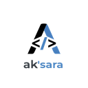

<!--
aksara:true
type: presentation
size: 16:9
style: ./style.css
meta:
    title: "MerdekaOS: Arch-based Linux Distribution for Indonesia"
    subtitle: "Proposal for developing Indonesian-focused Linux distribution"
    author: "Ak'sara Initiative"
    keywords: "Linux, Operating System, Indonesia, Arch Linux, Desktop"
header: | MerdekaOS Proposal |  |
footer: © 2025 Ak'sara Initiative
background: ../assets/background.jpeg
-->

<!-- class:cover -->
# MerdekaOS
## Arch-based Linux Distribution for Indonesian Users

**Project Proposal & Strategic Analysis**
*Ak'sara Initiative - Phase 3 Project*

---

# Executive Summary

**MerdekaOS** adalah distribusi Linux berbasis Arch yang dirancang khusus untuk user Indonesia, dengan fokus pada kemudahan penggunaan, performa optimal, dan dukungan hardware lokal yang excellent.

<div class="highlight">

**Vision:** Menciptakan alternatif OS yang powerful, ringan, dan mudah digunakan untuk mengurangi ketergantungan Indonesia pada sistem operasi proprietary.

</div>

<div class="stats">
  <div class="stat-item">
    <span class="stat-number">12-18</span>
    Bulan Pengembangan
  </div>
  <div class="stat-item">
    <span class="stat-number">$200K</span>
    Estimasi Budget
  </div>
  <div class="stat-item">
    <span class="stat-number">1M+</span>
    Target Users
  </div>
</div>

---
<!-- class:smallText -->
## Strategic Context
<div><div>

### **National Technology Independence**
- **Dependency Reduction**: Mengurangi ketergantungan pada Windows dan macOS
- **Local Hardware Support**: Optimasi untuk laptop dan PC yang dijual di Indonesia
- **Government Adoption**: Alternatif untuk institusi pemerintah
- **Educational Impact**: Platform pembelajaran untuk computer science

### **Market Opportunity**
- **Indonesia PC Market**: 15M+ units sold annually
- **Linux Adoption**: <2% market share, huge growth potential
- **Price Sensitivity**: Indonesian users need cost-effective solutions
- **Technical Skills**: Growing developer community needs good tools
</div><div>

### **Ak'sara Ecosystem Integration**
- **Bundled Software**: Pre-installed Aksara IS dan Aksara Writer
- **Development Platform**: Optimized untuk Indonesian developers
- **Business Ready**: Templates dan tools untuk SME digitalization

### **Key Benefits**
- **Zero License Cost**: Completely free alternative to proprietary OS
- **Performance Optimized**: Lightweight for older hardware
- **Indonesian Language**: Full localization and support
- **Developer Friendly**: Pre-configured development environment
</div></div>

---
<!-- class:small-text -->
## Technical Specifications

<div><div>

### **Base System Architecture**

**Foundation: Arch Linux**
- **Rolling release**: Always up-to-date packages
- **Lightweight**: Minimal base installation
- **Performance**: Optimized untuk resource efficiency
- **Customizable**: Flexible configuration options

**Desktop Environment: Custom GNOME**
- **Modern interface**: Clean, intuitive user experience
- **Indonesian localization**: Complete Bahasa Indonesia support
- **Performance tuned**: Optimized animations dan resource usage
- **Extensible**: Support untuk custom extensions
</div><div>

### **Hardware Optimization**

**Indonesian Laptop Brands Focus:**
- **Advan**: Driver optimization dan power management
- **Axioo**: Hardware compatibility testing
- **Polytron**: Performance tuning untuk specifications typical

**Common Hardware Support:**
- **Intel/AMD processors**: Optimized scheduling dan power management
- **Integrated graphics**: Intel HD, AMD Radeon optimization
- **WiFi chipsets**: Robust driver support untuk common adapters
- **Bluetooth**: Seamless device pairing dan management
</div></div>

---
<!-- class:smallText -->
## Key Features

### **User Experience Enhancements**
<div><div>

**Installation Experience:**
- **Graphical installer**: User-friendly setup wizard
- **Hardware detection**: Automatic driver installation
- **Partition management**: Safe dual-boot setup dengan Windows
- **User setup**: Indonesian keyboard, timezone, language
</div><div>

**Desktop Experience:**
- **Indonesian theme**: Batik-inspired visual design
- **Local applications**: Banking, e-commerce, government apps
- **Font optimization**: Beautiful Indonesian text rendering
- **Input methods**: Support untuk various Indonesian input
</div></div>

### **Pre-installed Software Suite**
<div><div>

**Productivity Applications:**
- **LibreOffice**: Fully localized dengan Indonesian templates
- **Aksara Writer**: Markdown converter untuk business documents
- **Web browsers**: Firefox dengan Indonesian bookmarks dan settings
- **Media tools**: VLC, GIMP untuk multimedia needs
</div><div>

**Development Tools:**
- **VS Code**: Pre-configured dengan Indonesian extensions
- **Node.js/Bun**: Modern JavaScript development
- **Python**: Data science dan web development
- **Git**: Version control dengan Indonesian documentation
</div><div>

**Business Applications:**
- **Aksara IS**: No-code platform pre-installed
- **Accounting software**: Local Indonesian accounting standards
- **PDF tools**: Invoice generation, document management
- **Communication**: Local messaging dan video call tools
</div></div>

---

## Market Analysis

### **Target User Segments**

**Primary Users:**
- **Office workers**: Government employees, SME staff
- **Students**: University students learning computer science
- **Developers**: Indonesian software developers
- **Small businesses**: Shop owners, freelancers

**Secondary Users:**
- **Educational institutions**: Schools dan universities
- **Government agencies**: Cost-conscious departments
- **Internet cafes**: Gaming centers, co-working spaces
- **Tech enthusiasts**: Linux users, open source advocates

---

## Market Analysis

### **Competitive Landscape**

| Distribution | Market Position | Strengths | Weaknesses |
|--------------|-----------------|-----------|------------|
| **Windows** | Dominant (85%) | Familiar, compatible | Expensive, bloated |
| **Ubuntu** | Linux leader (40% Linux) | User-friendly | Generic, not localized |
| **Elementary** | Design-focused | Beautiful interface | Limited software |
| **MerdekaOS** | Indonesian focus | Local optimization | **New entrant** |

---
<!-- class:smallText -->
## Development Roadmap

### **Phase 1: Core System (Months 1-6)**

**Focus**: Stable base system dengan Indonesian optimizations
<div><div>

**Deliverables:**
- Arch-based foundation dengan custom repositories
- Indonesian-themed desktop environment
- Hardware compatibility untuk major brands
- Basic installation system
- Alpha release untuk testing
</div><div>

**Team Requirements:**
- 2 system engineers
- 1 UI/UX designer
- 1 QA engineer
</div></div>

---
<!-- class:smallText -->
## Development Roadmap

### **Phase 2: Application Integration (Months 7-12)**
**Focus**: Pre-installed applications dan user experience
<div><div>

**Deliverables:**
- Complete software suite integration
- Aksara IS dan Aksara Writer pre-installation
- Indonesian language packs dan input methods
- Driver packages untuk common hardware
- Beta release dengan community testing
</div><div>

**Team Requirements:**
- 1 additional application developer
- 1 localization specialist
- 1 documentation writer
</div></div>

---
<!-- class:smallText -->
## Development Roadmap

### **Phase 3: Distribution & Support (Months 13-18)**
**Focus**: Public release dan ecosystem building
<div><div>

**Deliverables:**
- Stable 1.0 release
- OEM partnerships dengan laptop manufacturers
- Community support infrastructure
- Documentation dan training materials
- Update dan maintenance systems
</div><div>

**Team Requirements:**
- 1 community manager
- 1 business development
- 1 support engineer
</div></div>

---
<!-- class:smallText -->
## Business Model & Partnerships
<div><div>

### **Distribution Strategy**

**OEM Partnerships:**
- **Advan, Axioo, Polytron**: Pre-installed OS option
- **Revenue sharing**: $5-10 per unit dengan manufacturers
- **Support agreements**: Technical support untuk OEM customers
- **Marketing cooperation**: Joint promotional campaigns

**Direct Distribution:**
- **Free download**: Community edition dengan basic features
- **Premium edition**: $25 dengan additional software dan support
- **Enterprise edition**: $100 dengan management tools dan SLA
- **USB/DVD sales**: Physical media untuk areas dengan limited internet
</div><div>

### **Revenue Streams**

**1. OEM Licensing (60% revenue)**
- Partnership dengan laptop manufacturers
- Pre-installation revenue sharing
- Support service contracts

**2. Enterprise Services (30% revenue)**
- Custom deployment solutions
- Training dan consultation
- Long-term support contracts

**3. Application Ecosystem (10% revenue)**
- Software store commission
- Premium application sales
- Third-party integration fees
</div></div>

---
<!-- class:smallText -->
## Technical Implementation
<div><div>

### **Custom Package Repository**

**MerdekaOS Packages:**
- **Optimized kernels**: Power management, hardware support
- **Indonesian applications**: Banking, government, business tools
- **Local mirrors**: Fast download speeds untuk Indonesian users
- **Security updates**: Timely patches dan vulnerability fixes

**Development Infrastructure:**
- **Build systems**: Automated package building dan testing
- **Quality assurance**: Package validation dan compatibility testing
- **Community contributions**: Package maintainer program
- **Documentation**: Indonesian package development guides
</div><div>

### **System Architecture**

```
MerdekaOS Components:
├── Base System (Arch Linux)
├── Custom Desktop (GNOME + Indonesian theme)
├── Hardware Support (Driver packages)
├── Application Suite (Pre-installed software)
├── Indonesian Localization (Language, input, fonts)
├── Update System (Package management)
└── Support Infrastructure (Documentation, community)
```
</div></div>

---

## Market Entry Strategy

### **Phase 1: Developer Community (Months 1-6)**
**Target**: Indonesian Linux enthusiasts dan developers
<div><div>

**Approach:**
- Open source development di GitHub
- Tech conference presentations
- Developer community engagement
- Technical blogs dan tutorials
</div><div>

**Goals:**
- 1,000 alpha testers
- 100 community contributors
- Technical validation
- Hardware compatibility database
</div></div>

---

## Market Entry Strategy

### **Phase 2: Educational Adoption (Months 7-12)**
**Target**: Universities dan technical schools
<div><div>

**Approach:**
- Educational partnerships
- Student developer programs
- Campus deployment pilots
- Computer science curriculum integration
</div><div>

**Goals:**
- 10 university partnerships
- 5,000 student users
- Educational use cases validation
- Teaching material development
</div></div>

---

## Market Entry Strategy

### **Phase 3: Commercial Launch (Months 13-18)**
**Target**: OEM partnerships dan general users
<div><div>

**Approach:**
- Manufacturer negotiations
- Retail channel development
- Marketing campaigns
- Government procurement participation
</div><div>

**Goals:**
- 2 OEM partnerships
- 50,000 users
- Government pilot programs
- Revenue generation
</div></div>

---
<!-- class:smallText -->
## Risk Analysis & Mitigation

### **Technical Risks** 🟡

<div class="warning">

**Risk**: Hardware compatibility issues dengan Indonesian brands
**Mitigation**: Extensive testing program, manufacturer partnerships

**Risk**: Software ecosystem limitations dibanding Windows
**Mitigation**: Focus pada web applications, essential software porting

**Risk**: Update system complexity untuk non-technical users
**Mitigation**: Automated updates, simple UI, rollback capabilities

</div>

### **Market Risks** 🟡

<div class="warning">

**Risk**: User resistance untuk change dari Windows
**Mitigation**: Easy migration tools, dual-boot support, training programs

**Risk**: OEM reluctance untuk alternative OS
**Mitigation**: Compelling business case, technical support, marketing cooperation

**Risk**: Competition dari international Linux distributions
**Mitigation**: Indonesian-specific features, local partnerships, community building

</div>

### **Business Risks** 🟢

<div class="success">

**Risk**: Limited market size untuk Linux desktop
**Mitigation**: Focus pada growing segments (developers, students, government)

**Risk**: Sustainability dengan open source model
**Mitigation**: Multiple revenue streams, enterprise services, OEM partnerships

</div>

---

## Success Metrics & KPIs
<div><div>

### **Technical KPIs**
- **Boot time**: <20 seconds pada typical hardware
- **RAM usage**: <1GB idle consumption
- **Hardware compatibility**: >95% Indonesian laptop models
- **Package availability**: >80% essential applications

### **Adoption KPIs**
- **User base**: 10K (Month 6) → 50K (Month 12) → 250K (Month 18)
- **OEM partnerships**: 2 major manufacturers by Month 18
- **Educational adoption**: 25 institutions by Month 18
- **Community**: 500 active contributors, 50 package maintainers
</div><div>

### **Business KPIs**
- **Revenue**: $50K (Year 1) → $500K (Year 2) → $2M (Year 3)
- **Market share**: 0.1% Indonesian desktop market by Year 2
- **Support metrics**: <24 hour response time, >90% satisfaction
- **Ecosystem growth**: 100+ third-party applications
</div></div>

---

## Resource Requirements
<div><div>

### **Development Team**
- **System Architect**: Linux kernel + Arch expertise ($90K/year)
- **Desktop Developer**: GNOME customization ($70K/year)
- **Package Maintainer**: Repository management ($60K/year)
- **QA Engineer**: Testing + hardware validation ($55K/year)
- **UI/UX Designer**: Indonesian interface design ($65K/year)

### **Infrastructure Costs**
- **Build servers**: $20K/year
- **Package mirrors**: $30K/year (multiple Indonesian locations)
- **Testing hardware**: $15K one-time (various laptop models)
- **Development tools**: $10K/year
</div><div>

### **Business Operations**
- **Community management**: $40K/year
- **Documentation**: $25K/year
- **Marketing**: $50K/year
- **Legal compliance**: $15K/year
</div></div>

---
<!-- class:smallText -->
## Strategic Impact
<div><div>

### **National Technology Goals**
- **Digital sovereignty**: Reduced dependency pada foreign OS
- **Local innovation**: Platform untuk Indonesian software development
- **Educational advancement**: Modern tools untuk computer science education
- **Economic impact**: Support untuk local hardware manufacturers

### **Ak'sara Ecosystem Benefits**
- **Platform synergy**: Optimized environment untuk Aksara IS dan Writer
- **Developer adoption**: Attracts developers ke Ak'sara tools
- **Government relations**: Demonstrates commitment ke national tech independence
- **Brand recognition**: Establishes Ak'sara sebagai serious tech initiative
</div><div>

### **Long-term Vision**
- **Mobile OS**: Extension ke Android-based mobile OS
- **IoT platform**: Embedded systems untuk smart devices
- **Cloud integration**: Seamless integration dengan Indonesian cloud services
- **AI acceleration**: Optimized platform untuk local AI development
</div></div>

---

## Financial Projections

### **3-Year Revenue Projection**
<div><div>

**Year 1**: $50K
- 1,000 premium users × $25
- 2 OEM pilots × $12.5K
</div><div>

**Year 2**: $500K
- 10,000 premium users × $25
- 5 OEM partnerships × $50K
- Enterprise services: $100K
</div><div>

**Year 3**: $2M
- 50,000 premium users × $25
- 10 OEM partnerships × $125K
- Enterprise services: $500K
</div></div>

### **Investment Requirements**
<div><div>

- **Year 1**: $400K (team + infrastructure)
- **Year 2**: $600K (scaling + marketing)
- **Year 3**: $800K (expansion + enterprise features)
</div><div>

**Break-even**: Month 24
**ROI**: 3x over 5 years
</div></div>

---
<!-- class:smallText -->
## Conclusion

### **Strategic Recommendation**
<div><div>

### **Key Success Factors**
- **Technical excellence**: Reliable, performant system untuk Indonesian hardware
- **Strategic partnerships**: OEM cooperation untuk distribution
- **Community building**: Active developer dan user communities
- **Government support**: Alignment dengan national digitalization goals
</div><div>

### **Phased Approach Benefits**
- **Lower risk**: Gradual development dengan validation di each phase
- **Community-driven**: Open source development model
- **Market validation**: Testing dengan real users before commercial launch
- **Sustainable growth**: Revenue streams develop organically
</div><div>

### **Next Steps**
1. **Core team recruitment**: System architect dan desktop developer
2. **Infrastructure setup**: Build systems dan testing environment
3. **Alpha development**: 6-month sprint untuk basic functionality
4. **Community launch**: Open source release dengan developer community
</div></div>

<div class="highlight">

**MerdekaOS represents a bold vision untuk Indonesian technology independence**. Sebagai long-term strategic project, ini dapat significantly impact national digital sovereignty sambil strengthening Ak'sara ecosystem position.

</div>

---
<!-- class: quote center -->
**Contact Information:**
<br>
- **Project Lead**: [To be assigned]
- **Technical Architect**: [To be assigned]
- **Business Development**: [To be assigned]

**Email:** 
<br>
sponsor.aksara@tuta.com
contribute.aksara@tuta.com
partner.aksara@tuta.com
relations.aksara@tuta.com